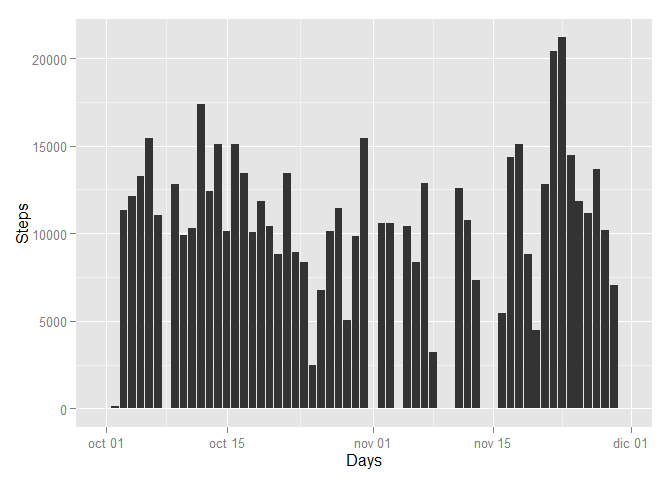
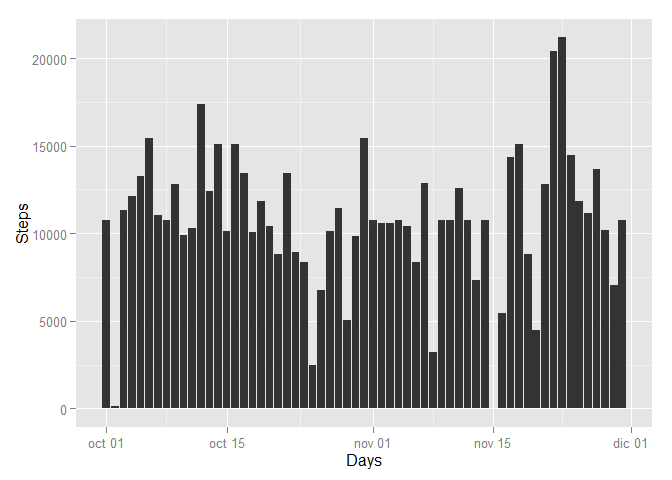

# Reproducible Research: Peer Assessment 1

Careful: knitr, ggplot2 and xtable packages are needed.


## Loading and preprocessing the data

The following code loads the data into a ***data*** variable and preprocess the *date* information transforming it into a non-factor format.

```r
data<-read.csv("./data/activity.csv");
data$date=as.Date(data$date);
Days=unique(as.Date(data$date));
```

## What is mean total number of steps taken per day?

The total number of the steps and the average of each can be computed by:

```r
Steps=c(rep(0,length(Days)))
Average=c(rep(0,length(Days)))
TD<-data.frame(Days,Steps,Average);
for (i in 1:length(Days)){
    TD$Steps[i]<-sum(data[data$date==Days[i],"steps"],na.rm=TRUE)
    TD$Average[i]<-sum(data[data$date==Days[i],"steps"],na.rm=TRUE)/sum(data$date==Days[1],na.rm=TRUE)
}
```

The following code plots the total amount of the steps given some day.

```r
Steps<-TD$Steps;
histData<-data.frame(Steps,Days)
p <- ggplot(histData, aes(Days,Steps)) + geom_histogram(stat="identity")
print(p)
```

 


By the other side, the mean of data per day and the median of the whole data are computed and organized in a table by:

```r
Mean=c(rep(0,length(Days)))
TD2<-data.frame(Days,Mean)
for (i in 1:length(Days)){
    TD2$Mean[i]<-round(mean(data[data$date==Days[i],"steps"],na.rm=TRUE),digits=4)
    #remove the Nan
    if(is.nan(TD2$Mean[i])) TD2$Mean[i]=0;
}


print.xtable(xtable(sapply(TD2,as.character),align="ccc"),type="html")
```

<!-- html table generated in R 3.1.2 by xtable 1.7-4 package -->
<!-- Sun May 17 18:07:38 2015 -->
<table border=1>
<tr> <th>  </th> <th> Days </th> <th> Mean </th>  </tr>
  <tr> <td align="center"> 1 </td> <td align="center"> 2012-10-01 </td> <td align="center"> 0 </td> </tr>
  <tr> <td align="center"> 2 </td> <td align="center"> 2012-10-02 </td> <td align="center"> 0.4375 </td> </tr>
  <tr> <td align="center"> 3 </td> <td align="center"> 2012-10-03 </td> <td align="center"> 39.4167 </td> </tr>
  <tr> <td align="center"> 4 </td> <td align="center"> 2012-10-04 </td> <td align="center"> 42.0694 </td> </tr>
  <tr> <td align="center"> 5 </td> <td align="center"> 2012-10-05 </td> <td align="center"> 46.1597 </td> </tr>
  <tr> <td align="center"> 6 </td> <td align="center"> 2012-10-06 </td> <td align="center"> 53.5417 </td> </tr>
  <tr> <td align="center"> 7 </td> <td align="center"> 2012-10-07 </td> <td align="center"> 38.2465 </td> </tr>
  <tr> <td align="center"> 8 </td> <td align="center"> 2012-10-08 </td> <td align="center"> 0 </td> </tr>
  <tr> <td align="center"> 9 </td> <td align="center"> 2012-10-09 </td> <td align="center"> 44.4826 </td> </tr>
  <tr> <td align="center"> 10 </td> <td align="center"> 2012-10-10 </td> <td align="center"> 34.375 </td> </tr>
  <tr> <td align="center"> 11 </td> <td align="center"> 2012-10-11 </td> <td align="center"> 35.7778 </td> </tr>
  <tr> <td align="center"> 12 </td> <td align="center"> 2012-10-12 </td> <td align="center"> 60.3542 </td> </tr>
  <tr> <td align="center"> 13 </td> <td align="center"> 2012-10-13 </td> <td align="center"> 43.1458 </td> </tr>
  <tr> <td align="center"> 14 </td> <td align="center"> 2012-10-14 </td> <td align="center"> 52.4236 </td> </tr>
  <tr> <td align="center"> 15 </td> <td align="center"> 2012-10-15 </td> <td align="center"> 35.2049 </td> </tr>
  <tr> <td align="center"> 16 </td> <td align="center"> 2012-10-16 </td> <td align="center"> 52.375 </td> </tr>
  <tr> <td align="center"> 17 </td> <td align="center"> 2012-10-17 </td> <td align="center"> 46.7083 </td> </tr>
  <tr> <td align="center"> 18 </td> <td align="center"> 2012-10-18 </td> <td align="center"> 34.9167 </td> </tr>
  <tr> <td align="center"> 19 </td> <td align="center"> 2012-10-19 </td> <td align="center"> 41.0729 </td> </tr>
  <tr> <td align="center"> 20 </td> <td align="center"> 2012-10-20 </td> <td align="center"> 36.0938 </td> </tr>
  <tr> <td align="center"> 21 </td> <td align="center"> 2012-10-21 </td> <td align="center"> 30.6285 </td> </tr>
  <tr> <td align="center"> 22 </td> <td align="center"> 2012-10-22 </td> <td align="center"> 46.7361 </td> </tr>
  <tr> <td align="center"> 23 </td> <td align="center"> 2012-10-23 </td> <td align="center"> 30.9653 </td> </tr>
  <tr> <td align="center"> 24 </td> <td align="center"> 2012-10-24 </td> <td align="center"> 29.0104 </td> </tr>
  <tr> <td align="center"> 25 </td> <td align="center"> 2012-10-25 </td> <td align="center"> 8.6528 </td> </tr>
  <tr> <td align="center"> 26 </td> <td align="center"> 2012-10-26 </td> <td align="center"> 23.5347 </td> </tr>
  <tr> <td align="center"> 27 </td> <td align="center"> 2012-10-27 </td> <td align="center"> 35.1354 </td> </tr>
  <tr> <td align="center"> 28 </td> <td align="center"> 2012-10-28 </td> <td align="center"> 39.7847 </td> </tr>
  <tr> <td align="center"> 29 </td> <td align="center"> 2012-10-29 </td> <td align="center"> 17.4236 </td> </tr>
  <tr> <td align="center"> 30 </td> <td align="center"> 2012-10-30 </td> <td align="center"> 34.0938 </td> </tr>
  <tr> <td align="center"> 31 </td> <td align="center"> 2012-10-31 </td> <td align="center"> 53.5208 </td> </tr>
  <tr> <td align="center"> 32 </td> <td align="center"> 2012-11-01 </td> <td align="center"> 0 </td> </tr>
  <tr> <td align="center"> 33 </td> <td align="center"> 2012-11-02 </td> <td align="center"> 36.8056 </td> </tr>
  <tr> <td align="center"> 34 </td> <td align="center"> 2012-11-03 </td> <td align="center"> 36.7049 </td> </tr>
  <tr> <td align="center"> 35 </td> <td align="center"> 2012-11-04 </td> <td align="center"> 0 </td> </tr>
  <tr> <td align="center"> 36 </td> <td align="center"> 2012-11-05 </td> <td align="center"> 36.2465 </td> </tr>
  <tr> <td align="center"> 37 </td> <td align="center"> 2012-11-06 </td> <td align="center"> 28.9375 </td> </tr>
  <tr> <td align="center"> 38 </td> <td align="center"> 2012-11-07 </td> <td align="center"> 44.7326 </td> </tr>
  <tr> <td align="center"> 39 </td> <td align="center"> 2012-11-08 </td> <td align="center"> 11.1771 </td> </tr>
  <tr> <td align="center"> 40 </td> <td align="center"> 2012-11-09 </td> <td align="center"> 0 </td> </tr>
  <tr> <td align="center"> 41 </td> <td align="center"> 2012-11-10 </td> <td align="center"> 0 </td> </tr>
  <tr> <td align="center"> 42 </td> <td align="center"> 2012-11-11 </td> <td align="center"> 43.7778 </td> </tr>
  <tr> <td align="center"> 43 </td> <td align="center"> 2012-11-12 </td> <td align="center"> 37.3785 </td> </tr>
  <tr> <td align="center"> 44 </td> <td align="center"> 2012-11-13 </td> <td align="center"> 25.4722 </td> </tr>
  <tr> <td align="center"> 45 </td> <td align="center"> 2012-11-14 </td> <td align="center"> 0 </td> </tr>
  <tr> <td align="center"> 46 </td> <td align="center"> 2012-11-15 </td> <td align="center"> 0.1424 </td> </tr>
  <tr> <td align="center"> 47 </td> <td align="center"> 2012-11-16 </td> <td align="center"> 18.8924 </td> </tr>
  <tr> <td align="center"> 48 </td> <td align="center"> 2012-11-17 </td> <td align="center"> 49.7882 </td> </tr>
  <tr> <td align="center"> 49 </td> <td align="center"> 2012-11-18 </td> <td align="center"> 52.4653 </td> </tr>
  <tr> <td align="center"> 50 </td> <td align="center"> 2012-11-19 </td> <td align="center"> 30.6979 </td> </tr>
  <tr> <td align="center"> 51 </td> <td align="center"> 2012-11-20 </td> <td align="center"> 15.5278 </td> </tr>
  <tr> <td align="center"> 52 </td> <td align="center"> 2012-11-21 </td> <td align="center"> 44.3993 </td> </tr>
  <tr> <td align="center"> 53 </td> <td align="center"> 2012-11-22 </td> <td align="center"> 70.9271 </td> </tr>
  <tr> <td align="center"> 54 </td> <td align="center"> 2012-11-23 </td> <td align="center"> 73.5903 </td> </tr>
  <tr> <td align="center"> 55 </td> <td align="center"> 2012-11-24 </td> <td align="center"> 50.2708 </td> </tr>
  <tr> <td align="center"> 56 </td> <td align="center"> 2012-11-25 </td> <td align="center"> 41.0903 </td> </tr>
  <tr> <td align="center"> 57 </td> <td align="center"> 2012-11-26 </td> <td align="center"> 38.7569 </td> </tr>
  <tr> <td align="center"> 58 </td> <td align="center"> 2012-11-27 </td> <td align="center"> 47.3819 </td> </tr>
  <tr> <td align="center"> 59 </td> <td align="center"> 2012-11-28 </td> <td align="center"> 35.3576 </td> </tr>
  <tr> <td align="center"> 60 </td> <td align="center"> 2012-11-29 </td> <td align="center"> 24.4688 </td> </tr>
  <tr> <td align="center"> 61 </td> <td align="center"> 2012-11-30 </td> <td align="center"> 0 </td> </tr>
   </table>
And:

```r
Median=median(histData$Steps,na.rm=TRUE);
Mean=mean(histData$Steps,na.rm=TRUE);
```

The median of the whole data is equal to ***1.0395\times 10^{4}***. 
The mean of the whole data is equal to ***9354.2295082***.

## What is the average daily activity pattern?

The code below can plot a time series in which the relation between the average of the steps and the interval is given.


```r
intervalSteps <- aggregate(steps ~ interval, data, mean)
g<-ggplot(intervalSteps,aes(interval,steps))+geom_line()
print(g)
```

 

```r
maxim<-intervalSteps[intervalSteps$steps==max(intervalSteps$steps),"interval"]
```

The interval with a maximum of the averaged steps is: ***835***


## Imputing missing values
As we want to know the total number of NAs in the dataset we can perform:

```r
counter<-sum(is.na(data))
```

And the total of NAs found is ***2304***.

To replace the NAs in the data we can execute the next code:

```r
tNAs<-is.na(data$steps);
newData<-data;
for (i in 1:length(tNAs)){
    if (tNAs[i]) newData[i,"steps"]<-intervalSteps[intervalSteps$interva==newData[i,"interval"],"steps"]    
}
```

The effect of the previous procedure can be seen on performing:


```r
Steps=c(rep(0,length(Days)))
Average=c(rep(0,length(Days)))
TD<-data.frame(Days,Steps,Average);
for (i in 1:length(Days)){
    TD$Steps[i]<-sum(newData[newData$date==Days[i],"steps"],na.rm=TRUE)
    TD$Average[i]<-sum(newData[newData$date==Days[i],"steps"],na.rm=TRUE)/sum(newData$date==Days[1],na.rm=TRUE)
}

Steps<-TD$Steps;
histData<-data.frame(Steps,Days)
p <- ggplot(histData, aes(Days,Steps)) + geom_histogram(stat="identity")
print(p)
```

 

And:


```r
Median2=median(histData$Steps,na.rm=TRUE);
Mean2=mean(histData$Steps,na.rm=TRUE);
```

Being the new median and the new mean ***1.0766189\times 10^{4}*** , ***1.0766189\times 10^{4}*** respectively.

There is a clear difference in the median because now the mean ***1.0766189\times 10^{4}*** is equal to the median ***1.0766189\times 10^{4}***.

## Are there differences in activity patterns between weekdays and weekends?
By setting the days into a new factor variable we can extract information about the question.
The following code creates the factor variable day in the dataset. The levels in the factor may be assigned by the criteria: weekday or weekend.
It also plots a comparison between both information, weekdays and weekends.

```r
sunday=0
newData[,"day"]<-as.POSIXlt(newData$date)$wday;
newData[newData$day==0,"day"]="weekend";
newData[newData$day==6,"day"]="weekend";
newData[newData$day==5,"day"]="weekday";
newData[newData$day==4,"day"]="weekday";
newData[newData$day==3,"day"]="weekday";
newData[newData$day==2,"day"]="weekday";
newData[newData$day==1,"day"]="weekday";
newData$day<-factor(newData$day,labels=c("weekday","weekend"))

intervalSteps2 <- aggregate(steps ~ interval+day, newData, mean)
xyplot(steps~interval|day,data=intervalSteps2,layout=c(1,2),type="l",xlab="Interval",ylab="Steps")
```

 
